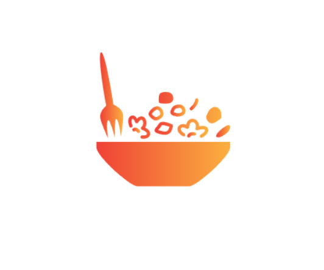

<!-- Improved compatibility of back to top link: See: https://github.com/othneildrew/Best-README-Template/pull/73 -->
<a id="readme-top"></a>
<!--
*** Thanks for checking out the Best-README-Template. If you have a suggestion
*** that would make this better, please fork the repo and create a pull request
*** or simply open an issue with the tag "enhancement".
*** Don't forget to give the project a star!
*** Thanks again! Now go create something AMAZING! :D
-->


<!-- PROJECT SHIELDS -->
<!--
*** I'm using markdown "reference style" links for readability.
*** Reference links are enclosed in brackets [ ] instead of parentheses ( ).
*** See the bottom of this document for the declaration of the reference variables
*** for contributors-url, forks-url, etc. This is an optional, concise syntax you may use.
*** https://www.markdownguide.org/basic-syntax/#reference-style-links
-->
[![Contributors][contributors-shield]][contributors-url]
[![Forks][forks-shield]][forks-url]
[![Stargazers][stars-shield]][stars-url]
[![Issues][issues-shield]][issues-url]


<!-- PROJECT LOGO -->
<br />
<div align="center">
  <a href="https://github.com/othneildrew/Best-README-Template">
    
  </a>

  <h3 align="center">Cooks Collective</h3>

  
</div>


<!-- TABLE OF CONTENTS -->
<details>
  <summary>Table of Contents</summary>
  <ol>
    <li><a href="#about-the-project">About The Project</a></li>
    <li><a href="#project-resources">Project Resources</a>
          <ul>
            <li>
              <a href="#erd">ERD</a>
            </li>
            <li>
              <a href="#ui-ux">UI / UX</a>
            </li>
            <li>
              <a href="#gantt-chart">Gantt Chart</a>
            </li>
          </ul>
    </li>
    <li><a href="#functional-requirements">Functional Requirements</a></li>
    <li><a href="#additional-features">Additional Features</a></li>
    <li><a href="#built-with">Built With</a></li>
    <li>
      <a href="#getting-started">Getting Started</a>
      <ul>
        <li><a href="#prerequisites">Prerequisites</a></li>
        <li><a href="#installation">Installation</a></li>
      </ul>
    </li>
    <li><a href="#contributing">Contributors</a></li>
    <li><a href="#contact">Contact</a></li>
  </ol>
</details>


<!-- ABOUT THE PROJECT -->
## ABOUT THE PROJECT

![Home Page][product-screenshot-0]

![Popular Recipes in Home Page][product-screenshot-1]

![View User Profile][product-screenshot-2]

![Adding Recipe][product-screenshot-3]

![Viewing Recipe 1][product-screenshot-4]

![Viewing Recipe 2][product-screenshot-5]

*Cooks Collective* is an online recipe-sharing platform designed to connect cooking enthusiasts, from novice home cooks to seasoned chefs.


<p align="right">(<a href="#readme-top">back to top</a>)</p>

## FUNCTIONAL REQUIREMENTS
1. **User Management**  

    Users can sign up, log in, log out, and manage their accounts.

2. **Recipe Submission**  

    Submit recipes with ingredients, instructions, and cooking details.

3. **Search Funcitonality**  

    Search recipes by name or ingredients, or maybe even search for users.

4. **Comment & Rating System**  

    Rate and comment on recipes from other users.

5. **Favorite Recipes**  

    Save favorite recipes to your profile.

6. **Popular Recipes Display**  

    View the most popular recipes on the home page.


## ADDITIONAL FEATURES

7. **Dark Mode Feature**  

    For users who prefer dark colors while traversing through the website.

6. **Reporting System**  

    Users can report users, comments, or recipes that violates basic desency upon using the website.


## Built With


[![HTML][HTML]][HTML-url]
[![CSS][CSS]][CSS-url]
[![JS][JS]][JS-url]
[![Node][Node]][Node-url]
[![Python][Python]][Python-url]
[![Django][Django]][Django-url]
[![SQLite][SQLite]][SQLite-url]


<p align="right">(<a href="#readme-top">back to top</a>)</p>

<!-- GETTING STARTED -->
##  **Getting Started**  

###  **Prerequisites**  

Before you start, ensure you have the following installed:

 [![Python][Python]][Python-url]

<p align="right">(<a href="#readme-top">back to top</a>)</p>

### **Installation**  

1. **Clone the repository**  
   Open your terminal and run the following command:
   ```bash
   git clone https://github.com/valceven/collective-cooks.git
   ```

2. **Create a virtual environment**  
   Open up a terminal and go to CollectiveCooks folder
   ```bash
   cd CollectiveCooks
   ```
   It’s recommended to create a virtual environment to manage dependencies:
   ```bash
   python -m venv venv
   ```
   or

   ```bash
   py -m venv venv
   ```

   Activate the virtual environment:
   - On **macOS/Linux**:
     ```bash
     source venv/bin/activate
     ```
   - On **Windows**:
     ```bash
     venv\Scripts\activate
     ```

3. **Install dependencies**  
   Install all the required packages from `requirements.txt`:
   ```bash
   pip install -r requirements.txt
   ```

4. **Run node.js**
    Open up a different terminal to run Node.js
    ```bash
     cd CollectiveCook/Foods/static_src
     npm run dev
    ```

5. **Apply database migrations**  
   Run the database migrations to set up the database schema:
   ```bash
   python manage.py makemigrations
   python manage.py migrate
   ```

6. **Start the development server**  
   Now, you can start the development server and view the project locally:
   ```bash
   python manage.py runserver
   ```

7. **Access the application**  
   Open your browser and go to `http://127.0.0.1:8000/` or `http://localhost:8000/` to see the application running locally.

<p align="right">(<a href="#readme-top">back to top</a>)</p>


<!-- CONTRIBUTING -->
## Contributing

### Top contributors:
<a href="https://github.com/valceven/collective-cooks/graphs/contributors"> 
   
</a>

<p align="right">(<a href="#readme-top">back to top</a>)</p>


<!-- CONTACT -->
## Contact

Val Mykel Ceven Bolante - [@valceven](https://www.facebook.com/valmykelceven.bolante) - VAL GMAIL

Dechie Sullano - [@dechie](https://www.facebook.com/dechie.abella) - DECHIE GMAIL

Fiel Louis Omas-as - [@fiellouis](https://www.facebook.com/fiellouis.omasas) - fiellouisomasas@gmail.com

Project Link: [https://github.com/valceven/collective-cooks](https://github.com/valceven/collective-cooks)

<p align="right">(<a href="#readme-top">back to top</a>)</p>


<!-- MARKDOWN LINKS & IMAGES -->
<!-- https://www.markdownguide.org/basic-syntax/#reference-style-links -->
[contributors-shield]: https://img.shields.io/github/contributors/valceven/collective-cooks.svg?style=for-the-badge
[contributors-url]: https://github.com/valceven/collective-cooks/graphs/contributors

[forks-shield]: https://img.shields.io/github/forks/valceven/collective-cooks.svg?style=for-the-badge
[forks-url]: https://github.com/valceven/collective-cooks/network/members

[stars-shield]: https://img.shields.io/github/stars/valceven/collective-cooks.svg?style=for-the-badge
[stars-url]: https://github.com/valceven/collective-cooks/stargazers

[issues-shield]: https://img.shields.io/github/issues/valceven/collective-cooks.svg?style=for-the-badge
[issues-url]: https://github.com/valceven/collective-cooks/issues

[product-screenshot-0]: images/product-screenshot-0.png
[product-screenshot-1]: images/product-screenshot-1.png
[product-screenshot-2]: images/product-screenshot-2.png
[product-screenshot-3]: images/product-screenshot-3.png
[product-screenshot-4]: images/product-screenshot-4.png
[product-screenshot-5]: images/product-screenshot-5.png

[Django]: https://img.shields.io/badge/django-092E20?style=for-the-badge&logo=django&logoColor=white
[Django-url]: https://www.djangoproject.com/

[SQLite]: https://img.shields.io/badge/sqlite-003B57?style=for-the-badge&logo=sqlite&logoColor=white
[SQLite-url]: https://www.sqlite.org/

[HTML]: https://img.shields.io/badge/html-E34F26?style=for-the-badge&logo=html5&logoColor=white
[HTML-url]: https://developer.mozilla.org/en-US/docs/Web/HTML

[CSS]: https://img.shields.io/badge/css-1572B6?style=for-the-badge&logo=css3&logoColor=white
[CSS-url]: https://developer.mozilla.org/en-US/docs/Web/CSS

[JS]: https://img.shields.io/badge/javascript-F7DF1E?style=for-the-badge&logo=javascript&logoColor=black
[JS-url]: https://developer.mozilla.org/en-US/docs/Web/JavaScript

[Node]: https://img.shields.io/badge/Node.js-8CC84B?style=for-the-badge&logo=node.js&logoColor=white
[Node-url]: https://nodejs.org/en/

[Python]: https://img.shields.io/badge/python-3776AB?style=for-the-badge&logo=python&logoColor=white
[Python-url]: https://www.python.org/

